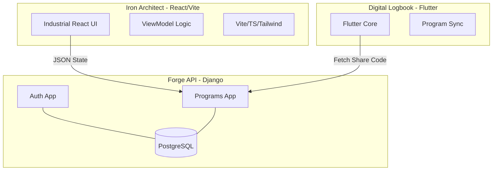

# Strength Lab: The Digital Iron Suite
## Project Proposal & Technical Specification

### 1. Executive Summary
**Strength Lab** is a high-fidelity, industrial-grade training ecosystem designed for serious athletes, powerlifters, and performance coaches. Moving beyond the generic fitness app market, Strength Lab leverages a high-contrast, "Industrial Brutalist" design philosophy to deliver a platform that feels like a professional engineering tool for the human body. 

The ecosystem consists of three main pillars:
1.  **Iron Architect (Web/Frontend)**: A spreadsheet-driven program builder with a grid-based interface for rapid workout design.
2.  **Forge API (Backend)**: A high-concurrency Django-based core that handles multi-platform synchronization via unique program share codes.
3.  **Digital Logbook (Mobile)**: A high-impact Flutter application for real-time workout logging, set tracking, and rest management.

---

### 2. Product Vision & Visual Prototypes

#### 2.1 The "Industrial Brutalist" Aesthetic
Strength Lab rejects the soft, approachable design of mainstream fitness apps in favor of a look that reflects the grit of the gym. 
- **High-Contrast Palette**: Sharp blacks, cold grays, and high-visibility accent colors (hazard orange, neon green).
- **Brutalist Elements**: Hard edges, visible grid lines, monospace typography, and a raw, functional feel.
- **"Digital Iron" Philosophy**: Every interaction should feel weighty and deliberate.

#### 2.2 Iron Architect (Web Mockup)

*Figure 1: The grid-based program builder utilizing high-contrast industrial themes.*

#### 2.3 Digital Logbook (Mobile Mockup)

*Figure 2: The high-intensity workout tracking interface with integrated rest timers.*

---

### 3. Core Ecosystem Features

#### 3.1 Iron Architect (Program Builder)
*   **Dynamic Grid Engine**: A spreadsheet-like interface supporting inline editing, cell resizing, and keyboard-driven navigation.
*   **Variable Injectors**: Support for RPE, percentage-based loading, and dynamic volume calculation.
*   **Rapid Distribution**: Instantly generate 6-character "Forge Codes" to sync programs to athletes' mobile devices.

#### 3.2 Forge API (System Core)
*   **Performance Tracking**: Full execution logging (Training Sessions & Set Logs) to track actual vs. programmed volume.
*   **Readiness Monitoring**: Daily morning check-ins for sleep, stress, and soreness to calculate "Ready to Train" scores.
*   **Asset Management**: Centralized Exercise Inventory with equipment tagging and muscle group categorization.
*   **Secure Auth & Messaging**: Multi-platform session management and a real-time communication bridge with media support.

#### 3.3 Digital Logbook (Mobile App)
*   **Real-Time Tracking**: High-resolution logging of every set, rep, and RPE score.
*   **Haptic rest cycles**: Visual and physical feedback for rest period management.
*   **Offline mesh**: Dedicated local persistence allowing logging in signal-dead zones (basement gyms) with background sync.

---

### 4. Advanced Strategic Ideas (Future Forge)

#### 4.1. Automated PR Prediction
Using historical SetLog data and regression algorithms to predict 1RM (One Rep Max) across all core lifts, providing coaches with real-time intensity adjustments.

#### 4.2. Bio-Feedback Fatigue Dial
Integrating wearable data (Heart Rate Variability, Sleep) into the Daily Readiness model to automatically "de-load" a program if the athlete's recovery is insufficient.

#### 4.3. AR Form Analysis
Leveraging mobile camera capability for real-time skeletal tracking during lifts, providing immediate feedback on bar path and depth.

#### 4.4. Team/Gym Hierarchy
White-labeling support for large gyms. A "Master Coach" can oversee a team of sub-coaches, manage shared exercise libraries, and aggregate gym-wide performance stats.

#### 4.5. The Community Forge
A marketplace/discovery engine for training programs where top coaches can monetize their "Iron Architect" templates and athletes can browse vetted training methodologies.

---
---

### 5. Technical Architecture
Strength Lab implements a modern **MVVM Clean Architecture** to ensure long-term maintainability and scalability.

#### System Overview

#### Key Technologies
-   **Backend**: Python 3.11+, Django, DRF, PostgreSQL.
-   **Frontend**: React, Vite, TypeScript, Tailwind CSS.
-   **Mobile**: Flutter, Dart, Riverpod.

---

### 5. Roadmap & Development Milestones

#### Phase 1: Foundation (Complete)
- [x] Initial Backend Migration to Django.
- [x] Functional Program Builder Grid Core.
- [x] Mobile App Core Architecture.

#### Phase 2: Synchronization & Intelligence (Current)
- [ ] **Program Sync**: Connect the Mobile Logbook to Forge API via share codes.
- [ ] **Interactive Grid**: Implement full dragging, resizing, and spreadsheet functions.
- [ ] **Communications**: Integrated Athlete Chat for direct coaching feedback.

#### Phase 3: Analytics & Scale (Future)
- [ ] **Advanced Analytics**: PR tracking, fatigue management charts, and long-term volume trends.
- [ ] **Organization Support**: Allow head coaches to manage multiple sub-coaches and gyms.

---

### 6. Conclusion
Strength Lab is more than an app; it is a professional-grade OS for training performance. By combining high-end design aesthetics with robust engineering, we provide athletes and coaches with the tools they need to achieve peak results.
